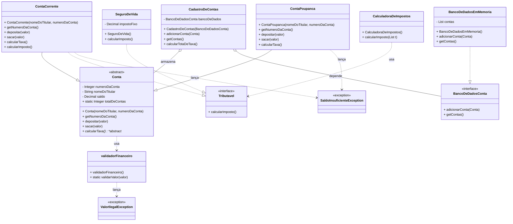

# Apex Training — Projeto de Exemplo (Salesforce DX)

Projeto de treinamento em Apex demonstrando conceitos de orientação a objetos, exceções, interfaces e polimorfismo, com exemplos de cadastro de contas, cálculo de taxas e impostos, e uso de serviços e validações.

## Resumo

- Código fonte Apex em `force-app/main/default/classes`.
- Scripts de execução e exemplos em `scripts/`.
- Implementa abstração de dados via interface e injeção de dependência.
- Demonstra uso de exceções customizadas e validação de regras de negócio.
- Inclui exemplos de polimorfismo com interface `Tributavel` e cálculo de impostos.

## Principais Classes e Estruturas

- **Conta (abstrata):** Base para contas bancárias, com métodos abstratos e regras de negócio comuns.
- **ContaCorrente:** Herda de Conta, implementa `Tributavel`, possui taxa e imposto.
- **ContaPoupanca:** Herda de Conta, regras específicas de taxa.
- **Tributavel (interface):** Contrato para cálculo de imposto.
- **SeguroDeVida:** Implementa `Tributavel`, imposto fixo.
- **CalculadoraDeImpostos:** Soma impostos de objetos `Tributavel` (polimorfismo).
- **CadastroDeContas:** Gerencia contas via interface de banco de dados.
- **BancoDeDadosConta (interface):** Abstrai operações de armazenamento de contas.
- **BancoDeDadosEmMemoria:** Implementação concreta de armazenamento em memória.
- **validadorFinanceiro:** Valida valores financeiros, lança exceção se inválido.
- **SaldoInsuficienteException / ValorIlegalException:** Exceções customizadas para regras de negócio.

## Diagrama UML das Classes Apex

---

## Observações e Boas Práticas

- **Abstração e Injeção de Dependência:** O serviço de cadastro de contas depende de uma interface de banco de dados, facilitando testes e extensibilidade.
- **Polimorfismo:** O cálculo de impostos é feito via interface, permitindo múltiplas implementações.
- **Validação e Exceções:** Todas as operações financeiras são validadas e lançam exceções customizadas para regras de negócio.
- **Organização:** Classes separadas por responsabilidade, facilitando manutenção e entendimento.

## Referências Úteis

- [Salesforce Extensions Documentation](https://developer.salesforce.com/tools/vscode/)
- [Salesforce CLI Setup Guide](https://developer.salesforce.com/docs/atlas.en-us.sfdx_setup.meta/sfdx_setup/sfdx_setup_intro.htm)
- [Salesforce DX Developer Guide](https://developer.salesforce.com/docs/atlas.en-us.sfdx_dev.meta/sfdx_dev/sfdx_dev_intro.htm)
- [Salesforce CLI Command Reference](https://developer.salesforce.com/docs/atlas.en-us.sfdx_cli_reference.meta/sfdx_cli_reference/cli_reference.htm)

