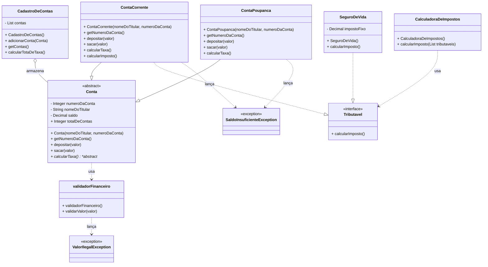

# Salesforce DX Project: Next Steps

Now that you’ve created a Salesforce DX project, what’s next? Here are some documentation resources to get you started.

## How Do You Plan to Deploy Your Changes?

Do you want to deploy a set of changes, or create a self-contained application? Choose a [development model](https://developer.salesforce.com/tools/vscode/en/user-guide/development-models).

## Configure Your Salesforce DX Project

The `sfdx-project.json` file contains useful configuration information for your project. See [Salesforce DX Project Configuration](https://developer.salesforce.com/docs/atlas.en-us.sfdx_dev.meta/sfdx_dev/sfdx_dev_ws_config.htm) in the _Salesforce DX Developer Guide_ for details about this file.

## Read All About It

- [Salesforce Extensions Documentation](https://developer.salesforce.com/tools/vscode/)
- [Salesforce CLI Setup Guide](https://developer.salesforce.com/docs/atlas.en-us.sfdx_setup.meta/sfdx_setup/sfdx_setup_intro.htm)
- [Salesforce DX Developer Guide](https://developer.salesforce.com/docs/atlas.en-us.sfdx_dev.meta/sfdx_dev/sfdx_dev_intro.htm)
- [Salesforce CLI Command Reference](https://developer.salesforce.com/docs/atlas.en-us.sfdx_cli_reference.meta/sfdx_cli_reference/cli_reference.htm)

 # Apex Training — Projeto de Exemplo (Salesforce DX)

Pequeno projeto de treinamento em Apex com exemplos de cadastro de contas, cálculo de impostos e seguro de vida.

**Resumo**
- Contém classes de domínio, uma interface `Tributavel`, scripts de Apex e consultas SOQL.
- Código fonte em `force-app/main/default/classes`; scripts em `scripts/`.

**Quick Start (objetivo)**

**Pré-requisitos**

## Diagrama UML das Classes Apex

O diagrama abaixo mostra as principais classes, heranças, implementações e dependências do projeto:

---

## Conclusão

**Classe abstrata Conta:**
É uma abstração de conta que será herdada com atributos gerais, com métodos abstratos e com regras de negócios estabelecidas.

**Classe serviço Cadastro de contas:**
É uma classe que faz o gerenciamento/ciclo de vida de cadastro, deleção, queries e etc. Possui uma problemática: depende especificamente de um "banco de dados" em memória (lista de contas). **Solução:** abstração — a classe deve depender de uma interface que define o banco, e a implementação concreta fornece o armazenamento.

**Conta Corrente e Poupança:**
São classes que herdam a classe abstrata Conta e seus métodos, porém com regras de negócios diferentes. Conta Corrente possui taxa e o método imposto, algo que Conta Poupança não possui. Ambos os métodos sobrescrevem os métodos de Conta, porém de formas diferentes.

**Interface Tributavel:**
Define o contrato para cálculo de imposto. Classes que implementam essa interface devem fornecer sua própria lógica para o método `calcularImposto()`.

**Classe SeguroDeVida:**
Implementa a interface `Tributavel` e representa um seguro de vida com imposto fixo. Útil para demonstrar polimorfismo no cálculo de impostos.

**Classe CalculadoraDeImpostos:**
Classe utilitária que recebe uma lista de objetos `Tributavel` e soma os impostos de cada um, demonstrando uso de interface e polimorfismo.

**Classe SaldoInsuficienteException:**
Exceção personalizada lançada quando uma operação de saque não pode ser realizada por falta de saldo suficiente.

**Classe ValorIlegalException:**
Exceção personalizada lançada quando um valor inválido (menor ou igual a zero) é informado em operações financeiras.

**Classe validadorFinanceiro:**
Classe utilitária responsável por validar valores financeiros, lançando exceção do tipo `ValorIlegalException` caso o valor seja inválido (menor ou igual a zero).

